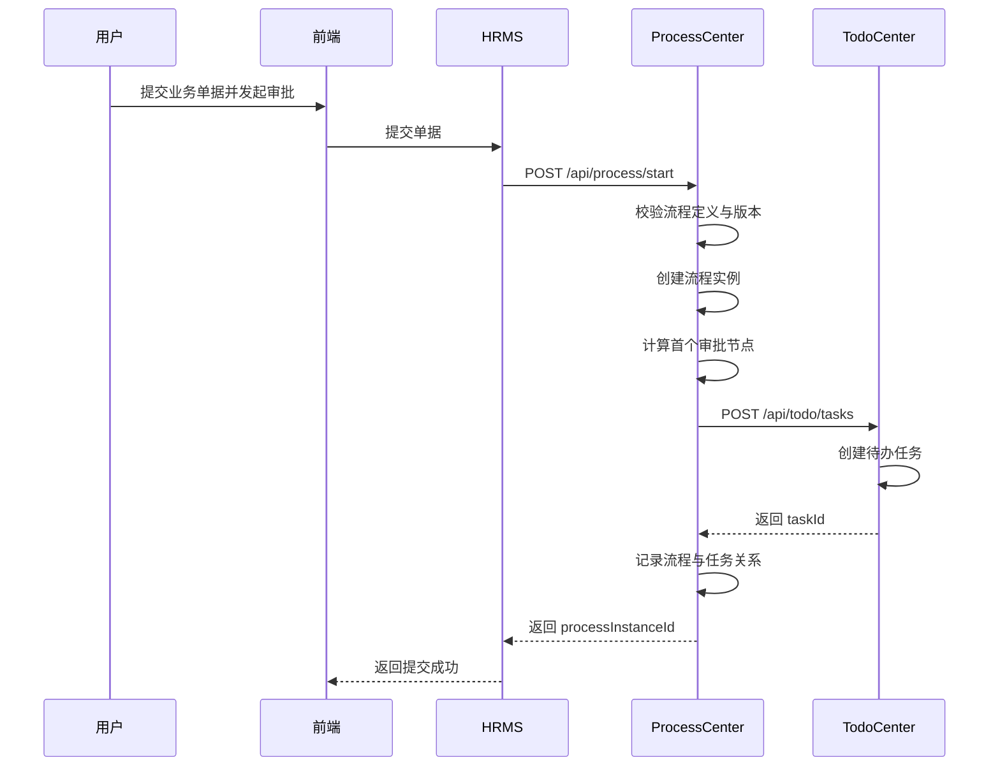
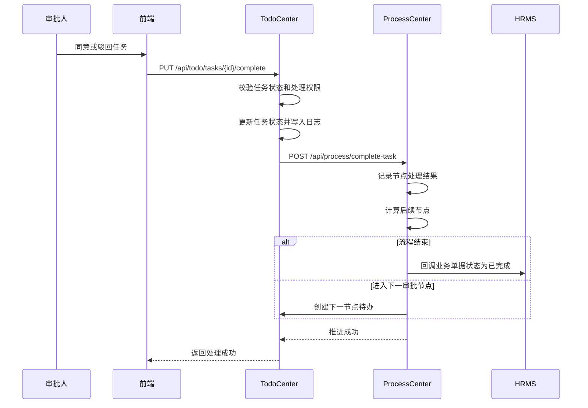
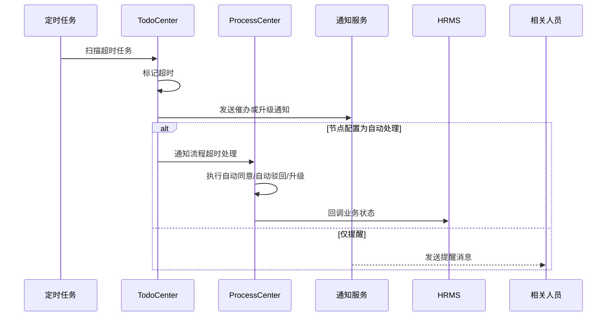

# 待办中心与流程中心技术设计说明书

## 1. 文档信息

### 1.1 文档目标

本文档用于将 `待办中心（TodoCenter）` 与 `流程中心（ProcessCenter）` 从 HRMS 业务系统中拆分为独立服务，并给出可落地的技术设计，包括：

- 服务职责与边界
- 模块划分与部署架构
- 对外接口与交互方式
- 核心数据模型与表结构设计
- 关键业务时序图
- 非功能设计与实施路径

### 1.2 适用范围

- 当前 HRMS 系统的人事审批、任务中心、流程中心建设
- 后续其他业务系统复用统一待办与流程能力

### 1.3 设计原则

- 业务解耦
- 服务自治
- 渐进迁移
- 最终一致性
- 可观测与可运维

## 2. 背景与目标

### 2.1 现状问题

当前 HRMS 中若直接内嵌待办和流程能力，会出现以下问题：

- 业务逻辑与审批流转逻辑耦合严重
- 新增审批场景需要频繁修改业务系统核心代码
- 待办能力无法复用于其他系统
- 审批峰值与业务峰值无法独立扩缩容
- 团队职责边界不清晰

### 2.2 建设目标

- 将待办能力沉淀为统一平台服务
- 将流程编排能力沉淀为统一流程引擎服务
- 保持 HRMS 作为业务域系统，专注业务单据和业务规则
- 通过标准 API 对接，实现低耦合和可替换

## 3. 总体架构设计

### 3.1 服务定位

#### 3.1.1 待办中心（TodoCenter）

- 基础路径：`/api/todo`
- 服务职责：统一管理所有人工任务，包括创建、领取、转交、审批、驳回、催办、代理、统计、通知

#### 3.1.2 流程中心（ProcessCenter）

- 基础路径：`/api/process`
- 服务职责：统一管理流程定义、版本、流程实例、节点路由、审批策略、超时处理、业务回调

#### 3.1.3 HRMS 业务系统

- 负责员工、人事、薪资、工时、组织等业务域
- 负责业务单据及单据状态
- 通过 HTTP API 启动流程、查询流程、接收流程回调

### 3.2 总体拓扑图

```text
前端
  -> API Gateway / Nginx
      -> HRMS
      -> TodoCenter
      -> ProcessCenter

HRMS
  -> ProcessCenter

ProcessCenter
  -> TodoCenter
  -> HRMS 业务回调接口

TodoCenter
  -> Redis
  -> RabbitMQ

TodoCenter / ProcessCenter
  -> MySQL
```

### 3.3 逻辑边界

| 系统 | 核心职责 | 不负责内容 |
|------|-----------|------------|
| HRMS | 业务单据、业务状态、业务校验 | 流程路由、通用待办分发 |
| ProcessCenter | 流程定义、流程实例、节点推进 | 具体业务数据存储 |
| TodoCenter | 人工任务、代理、催办、统计、通知 | 流程结构计算 |

## 4. 模块设计

### 4.1 TodoCenter 模块划分

| 模块 | 说明 |
|------|------|
| Task API | 提供任务创建、查询、处理、转交、催办等接口 |
| Task Engine | 负责任务状态流转与校验 |
| Agent Service | 负责代理审批规则计算 |
| Notify Service | 负责站内信、邮件、钉钉、企微通知 |
| KPI Service | 负责待办统计和报表聚合 |
| Task Scheduler | 负责超时检测、催办、升级处理 |

### 4.2 ProcessCenter 模块划分

| 模块 | 说明 |
|------|------|
| Definition API | 负责流程定义与版本管理 |
| Instance API | 负责流程启动、推进、驳回、终止 |
| Route Engine | 负责条件分支、审批策略、节点选人 |
| Task Adapter | 负责调用 TodoCenter 创建任务 |
| Timeout Service | 负责超时升级、自动同意、自动驳回 |
| Callback Service | 负责回调 HRMS 更新业务单据状态 |

## 5. 关键业务流程

### 5.1 典型调用链

```text
HRMS 发起审批
  -> ProcessCenter 启动流程实例
  -> ProcessCenter 计算当前审批节点
  -> ProcessCenter 调用 TodoCenter 创建任务
  -> 用户在前端处理待办
  -> TodoCenter 接收完成结果
  -> TodoCenter 回调或通知 ProcessCenter
  -> ProcessCenter 推进下一节点或结束流程
  -> ProcessCenter 回调 HRMS 更新业务状态
```

### 5.2 关键时序图一：启动流程



### 5.3 关键时序图二：处理待办并推进流程



### 5.4 关键时序图三：超时处理



## 6. 接口设计

### 6.1 协议与认证

- 协议：`HTTP REST + JSON`
- 认证：`JWT Token`
- 传输：生产环境必须启用 `HTTPS`
- 建议：
  - 初期复用 HRMS 签发 Token
  - 中长期建议接入统一认证中心
  - 所有跨服务回调增加签名、时间戳、重放保护

### 6.2 接口约定

- 所有接口统一返回 `code`、`message`、`data`、`traceId`
- 所有写操作接口支持幂等键 `Idempotency-Key`
- 所有内部调用透传 `traceId`，便于链路追踪

### 6.3 待办中心关键接口

| 方法 | 路径 | 说明 |
|------|------|------|
| POST | `/api/todo/tasks` | 创建任务 |
| GET | `/api/todo/tasks/{id}` | 查询任务详情 |
| GET | `/api/todo/tasks/my-tasks` | 查询我的待办 |
| PUT | `/api/todo/tasks/{id}/complete` | 完成任务 |
| PUT | `/api/todo/tasks/{id}/reject` | 驳回任务 |
| PUT | `/api/todo/tasks/{id}/transfer` | 转交任务 |
| POST | `/api/todo/tasks/batch/complete` | 批量完成 |
| POST | `/api/todo/tasks/{id}/urge` | 催办 |
| POST | `/api/todo/agent/settings` | 设置代理规则 |
| GET | `/api/todo/kpi/summary` | 查询 KPI 汇总 |

### 6.4 流程中心关键接口

| 方法 | 路径 | 说明 |
|------|------|------|
| POST | `/api/process/start` | 启动流程 |
| GET | `/api/process/instance/{id}` | 查询流程实例 |
| POST | `/api/process/complete-task` | 接收任务完成并推进流程 |
| POST | `/api/process/instance/{id}/reject` | 驳回流程 |
| POST | `/api/process/instance/{id}/terminate` | 终止流程 |
| GET | `/api/process/definitions` | 查询流程定义 |
| POST | `/api/process/definitions` | 新建流程定义 |
| PUT | `/api/process/definitions/{id}/publish` | 发布流程版本 |

## 7. 数据库设计

### 7.1 设计原则

- TodoCenter 与 ProcessCenter 分库部署
- 主表保留必要冗余字段，降低跨表查询成本
- 所有业务主键统一使用 `bigint` 或 `snowflake string`
- 所有状态字段明确枚举值
- 所有关键表包含创建时间、更新时间、创建人、更新人、逻辑删除标记

### 7.2 TodoCenter 表结构

#### 7.2.1 `task` 任务主表

| 字段 | 类型 | 说明 |
|------|------|------|
| id | bigint | 主键 |
| task_no | varchar(64) | 任务编号 |
| task_type_code | varchar(64) | 任务类型编码 |
| title | varchar(200) | 任务标题 |
| business_system | varchar(64) | 来源业务系统 |
| business_type | varchar(64) | 业务类型 |
| business_id | varchar(64) | 业务单据 ID |
| process_instance_id | varchar(64) | 流程实例 ID |
| process_node_id | varchar(64) | 流程节点 ID |
| assignee_id | varchar(64) | 当前处理人 |
| assignee_name | varchar(100) | 当前处理人名称 |
| owner_dept_id | varchar(64) | 所属部门 |
| priority | tinyint | 优先级 |
| status | varchar(32) | 任务状态 |
| result | varchar(32) | 处理结果 |
| due_time | datetime | 截止时间 |
| completed_time | datetime | 完成时间 |
| source_payload | json | 来源业务快照 |
| ext_data | json | 扩展数据 |
| created_by | varchar(64) | 创建人 |
| created_time | datetime | 创建时间 |
| updated_by | varchar(64) | 更新人 |
| updated_time | datetime | 更新时间 |
| is_deleted | bit | 逻辑删除 |

建议索引：

- `uk_task_no(task_no)`
- `idx_task_assignee_status(assignee_id, status)`
- `idx_task_business(business_type, business_id)`
- `idx_task_process(process_instance_id, process_node_id)`
- `idx_task_due_time(status, due_time)`

状态建议：

- `Pending`
- `Processing`
- `Completed`
- `Rejected`
- `Transferred`
- `Cancelled`
- `Timeout`

#### 7.2.2 `task_type` 任务类型配置表

| 字段 | 类型 | 说明 |
|------|------|------|
| id | bigint | 主键 |
| type_code | varchar(64) | 类型编码 |
| type_name | varchar(100) | 类型名称 |
| business_type | varchar(64) | 关联业务类型 |
| default_priority | tinyint | 默认优先级 |
| timeout_minutes | int | 超时时长 |
| allow_transfer | bit | 是否允许转交 |
| allow_delegate | bit | 是否允许代理 |
| notify_channels | varchar(200) | 通知渠道 |
| is_active | bit | 是否启用 |
| remark | varchar(500) | 备注 |
| created_time | datetime | 创建时间 |
| updated_time | datetime | 更新时间 |

#### 7.2.3 `agent_setting` 代理规则表

| 字段 | 类型 | 说明 |
|------|------|------|
| id | bigint | 主键 |
| principal_user_id | varchar(64) | 被代理人 |
| agent_user_id | varchar(64) | 代理人 |
| scope_type | varchar(32) | 代理范围 |
| task_type_code | varchar(64) | 指定任务类型 |
| start_time | datetime | 生效开始 |
| end_time | datetime | 生效结束 |
| status | varchar(32) | 状态 |
| created_time | datetime | 创建时间 |
| updated_time | datetime | 更新时间 |

#### 7.2.4 `task_log` 任务操作日志表

| 字段 | 类型 | 说明 |
|------|------|------|
| id | bigint | 主键 |
| task_id | bigint | 任务 ID |
| action | varchar(32) | 操作类型 |
| operator_id | varchar(64) | 操作人 |
| operator_name | varchar(100) | 操作人名称 |
| action_result | varchar(32) | 操作结果 |
| comment | varchar(1000) | 处理意见 |
| before_status | varchar(32) | 变更前状态 |
| after_status | varchar(32) | 变更后状态 |
| ext_data | json | 扩展数据 |
| created_time | datetime | 创建时间 |

#### 7.2.5 `task_notify_log` 通知日志表

| 字段 | 类型 | 说明 |
|------|------|------|
| id | bigint | 主键 |
| task_id | bigint | 任务 ID |
| notify_type | varchar(32) | 通知类型 |
| receiver_id | varchar(64) | 接收人 |
| receiver_name | varchar(100) | 接收人名称 |
| channel | varchar(32) | 发送渠道 |
| status | varchar(32) | 发送状态 |
| content | text | 发送内容 |
| retry_count | int | 重试次数 |
| sent_time | datetime | 发送时间 |
| created_time | datetime | 创建时间 |

#### 7.2.6 `kpi_summary` KPI 汇总表

| 字段 | 类型 | 说明 |
|------|------|------|
| id | bigint | 主键 |
| stat_date | date | 统计日期 |
| dim_type | varchar(32) | 统计维度类型 |
| dim_value | varchar(64) | 统计维度值 |
| total_count | int | 总任务数 |
| completed_count | int | 完成数 |
| timeout_count | int | 超时数 |
| avg_duration_minutes | decimal(18,2) | 平均处理时长 |
| ontime_rate | decimal(8,4) | 按时完成率 |
| created_time | datetime | 创建时间 |

### 7.3 ProcessCenter 表结构

#### 7.3.1 `process_definition` 流程定义主表

| 字段 | 类型 | 说明 |
|------|------|------|
| id | bigint | 主键 |
| process_code | varchar(64) | 流程编码 |
| process_name | varchar(100) | 流程名称 |
| business_type | varchar(64) | 关联业务类型 |
| latest_version | int | 最新版本 |
| published_version | int | 已发布版本 |
| status | varchar(32) | 状态 |
| remark | varchar(500) | 备注 |
| created_by | varchar(64) | 创建人 |
| created_time | datetime | 创建时间 |
| updated_by | varchar(64) | 更新人 |
| updated_time | datetime | 更新时间 |

#### 7.3.2 `process_definition_version` 流程定义版本表

| 字段 | 类型 | 说明 |
|------|------|------|
| id | bigint | 主键 |
| process_definition_id | bigint | 流程定义 ID |
| version_no | int | 版本号 |
| definition_json | json | 流程定义 JSON |
| checksum | varchar(128) | 校验码 |
| publish_status | varchar(32) | 发布状态 |
| published_by | varchar(64) | 发布人 |
| published_time | datetime | 发布时间 |
| created_time | datetime | 创建时间 |

#### 7.3.3 `process_instance` 流程实例表

| 字段 | 类型 | 说明 |
|------|------|------|
| id | bigint | 主键 |
| instance_no | varchar(64) | 实例编号 |
| process_code | varchar(64) | 流程编码 |
| version_no | int | 流程版本 |
| business_system | varchar(64) | 来源系统 |
| business_type | varchar(64) | 业务类型 |
| business_id | varchar(64) | 业务单据 ID |
| status | varchar(32) | 实例状态 |
| current_node_id | varchar(64) | 当前节点 ID |
| current_node_name | varchar(100) | 当前节点名称 |
| starter_id | varchar(64) | 发起人 ID |
| starter_name | varchar(100) | 发起人名称 |
| started_time | datetime | 发起时间 |
| finished_time | datetime | 结束时间 |
| ext_data | json | 扩展数据 |
| created_time | datetime | 创建时间 |
| updated_time | datetime | 更新时间 |

状态建议：

- `Running`
- `Completed`
- `Rejected`
- `Terminated`
- `Cancelled`
- `Timeout`

#### 7.3.4 `process_instance_variable` 流程变量表

| 字段 | 类型 | 说明 |
|------|------|------|
| id | bigint | 主键 |
| process_instance_id | bigint | 流程实例 ID |
| var_key | varchar(100) | 变量键 |
| var_type | varchar(32) | 变量类型 |
| var_value | text | 变量值 |
| created_time | datetime | 创建时间 |
| updated_time | datetime | 更新时间 |

#### 7.3.5 `process_node_history` 节点历史表

| 字段 | 类型 | 说明 |
|------|------|------|
| id | bigint | 主键 |
| process_instance_id | bigint | 流程实例 ID |
| node_id | varchar(64) | 节点 ID |
| node_name | varchar(100) | 节点名称 |
| node_type | varchar(32) | 节点类型 |
| handler_id | varchar(64) | 处理人 ID |
| handler_name | varchar(100) | 处理人名称 |
| action | varchar(32) | 处理动作 |
| action_result | varchar(32) | 处理结果 |
| comment | varchar(1000) | 处理意见 |
| arrived_time | datetime | 到达时间 |
| handled_time | datetime | 处理时间 |
| duration_minutes | decimal(18,2) | 节点耗时 |
| ext_data | json | 扩展数据 |
| created_time | datetime | 创建时间 |

#### 7.3.6 `process_task_rel` 流程任务关联表

| 字段 | 类型 | 说明 |
|------|------|------|
| id | bigint | 主键 |
| process_instance_id | bigint | 流程实例 ID |
| node_id | varchar(64) | 节点 ID |
| task_id | bigint | 任务 ID |
| task_no | varchar(64) | 任务编号 |
| relation_type | varchar(32) | 关联类型 |
| created_time | datetime | 创建时间 |

#### 7.3.7 `process_listener_log` 监听器日志表

| 字段 | 类型 | 说明 |
|------|------|------|
| id | bigint | 主键 |
| process_instance_id | bigint | 流程实例 ID |
| node_id | varchar(64) | 节点 ID |
| listener_name | varchar(100) | 监听器名称 |
| event_name | varchar(64) | 事件名称 |
| execute_status | varchar(32) | 执行状态 |
| request_payload | json | 请求内容 |
| response_payload | json | 响应内容 |
| error_message | varchar(2000) | 错误信息 |
| created_time | datetime | 创建时间 |

## 8. 状态流转设计

### 8.1 任务状态流转

```text
Pending -> Processing -> Completed
Pending -> Rejected
Pending -> Transferred
Pending -> Timeout
Pending -> Cancelled
```

### 8.2 流程实例状态流转

```text
Running -> Completed
Running -> Rejected
Running -> Terminated
Running -> Timeout
Running -> Cancelled
```

## 9. 非功能设计

### 9.1 一致性设计

- 不采用跨服务分布式强事务
- 采用最终一致性
- 通过任务日志、流程历史、回调重试、死信队列保障可恢复性

### 9.2 幂等设计

- 启动流程接口基于 `business_type + business_id + request_id` 做幂等
- 创建任务接口基于 `process_instance_id + node_id + assignee_id` 做幂等
- 回调接口基于 `event_id` 做幂等

### 9.3 安全设计

- JWT 鉴权
- 服务间回调签名校验
- 关键接口审计日志
- 敏感字段脱敏输出

### 9.4 可观测性

- 日志：结构化日志，记录 `traceId`
- 指标：任务创建量、任务超时量、流程耗时、回调失败次数
- 告警：超时堆积、回调失败率、MQ 消费异常

## 10. 部署设计

### 10.1 独立部署示例（Docker Compose）

```yaml
version: '3.8'

services:
  hrms:
    image: hrms/hrms-api:latest
    ports:
      - "8080:80"
    environment:
      - ASPNETCORE_ENVIRONMENT=Production

  todo-center:
    image: hrms/todo-center:latest
    ports:
      - "8081:80"
    environment:
      - DB_CONNECTION=Server=mysql_todo;Database=todo_db;User=root;Password=123456;
      - REDIS_CONNECTION=redis:6379
      - MQ_CONNECTION=rabbitmq://rabbitmq:5672
    depends_on:
      - mysql_todo
      - redis
      - rabbitmq

  process-center:
    image: hrms/process-center:latest
    ports:
      - "8082:80"
    environment:
      - DB_CONNECTION=Server=mysql_process;Database=process_db;User=root;Password=123456;
      - TODO_CENTER_URL=http://todo-center:80
    depends_on:
      - mysql_process
      - todo-center

  mysql_todo:
    image: mysql:8.0
    environment:
      - MYSQL_ROOT_PASSWORD=123456
      - MYSQL_DATABASE=todo_db
    volumes:
      - todo_data:/var/lib/mysql

  mysql_process:
    image: mysql:8.0
    environment:
      - MYSQL_ROOT_PASSWORD=123456
      - MYSQL_DATABASE=process_db
    volumes:
      - process_data:/var/lib/mysql

  redis:
    image: redis:7-alpine

  rabbitmq:
    image: rabbitmq:3-management

volumes:
  todo_data:
  process_data:
```

### 10.2 网关路由示例

```nginx
location /api/todo/ {
    proxy_pass http://todo-center:8081;
}

location /api/process/ {
    proxy_pass http://process-center:8082;
}

location /api/ {
    proxy_pass http://hrms:8080;
}
```

### 10.3 部署建议

- 开发环境：可同机部署，优先验证调用链
- 测试环境：按真实网关路由和独立数据库部署
- 生产环境：服务独立容器化，支持水平扩容

## 11. 实施方案

### 11.1 第一阶段：梳理与抽象

- 梳理现有审批和任务相关业务代码
- 明确服务边界、业务归属和主数据来源

### 11.2 第二阶段：基础框架搭建

- 创建 `TodoCenter` 解决方案
- 创建 `ProcessCenter` 解决方案
- 初始化数据库迁移脚本和基础设施

### 11.3 第三阶段：能力内聚

- 先落地待办中心任务能力
- 再落地流程定义、流程实例和任务联动能力

### 11.4 第四阶段：对接 HRMS

- 将 HRMS 原审批入口切换为调用流程中心
- 将前端待办中心切换到统一待办接口

### 11.5 第五阶段：灰度与替换

- 分业务场景灰度迁移
- 清理旧逻辑和冗余表结构

## 12. 风险与控制措施

| 风险项 | 风险说明 | 控制措施 |
|--------|----------|----------|
| 认证不一致 | 多服务 JWT 校验规则不统一 | 统一密钥、统一中间件、预留认证中心 |
| 幂等缺失 | 重试导致重复任务或重复流程 | 全链路引入幂等键 |
| 回调失败 | 流程结束但业务状态未更新 | 回调重试、死信队列、人工补偿 |
| 数据不一致 | 任务、流程、业务状态不同步 | 最终一致性设计与审计日志 |
| 超时策略复杂 | 不同流程超时动作不一致 | 超时策略配置化 |

## 13. 结论

通过将 `TodoCenter` 与 `ProcessCenter` 设计为独立服务，可以实现：

- 业务系统与待办流程能力解耦
- 服务独立扩缩容和独立部署
- 统一任务平台和统一流程平台沉淀
- 后续跨系统复用与技术栈替换

对于当前 HRMS 以及未来规模扩展场景，该方案具备良好的可维护性、可扩展性和平台化价值。

---

文档结束。
