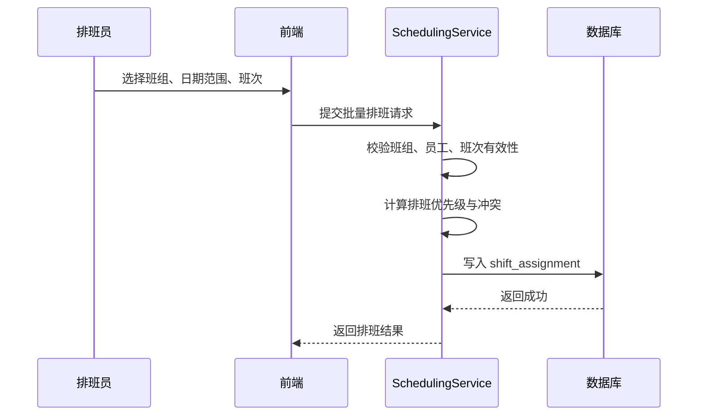
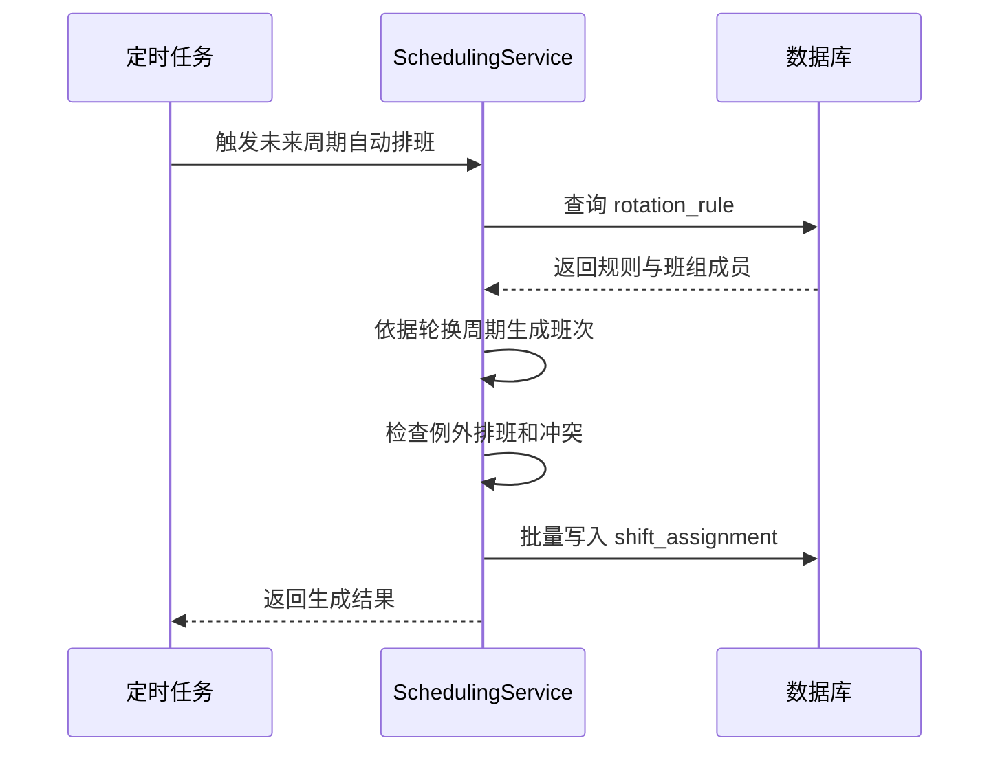
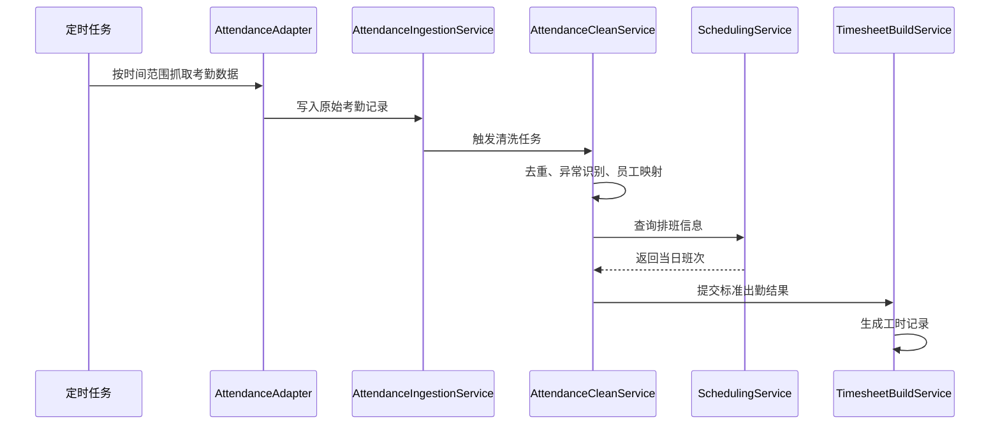
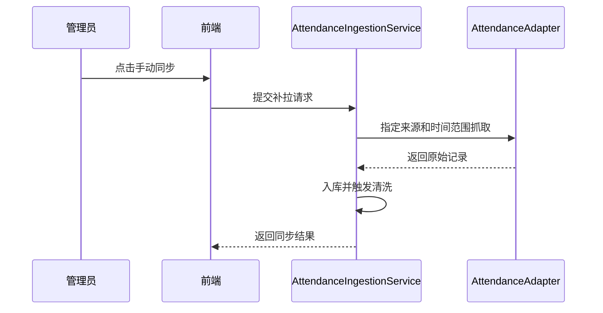

# 排班功能与多渠道考勤数据抓取技术设计说明书

## 1. 文档信息

### 1.1 文档目标

本文档用于说明 HRMS 系统中 `排班功能` 与 `多渠道考勤数据抓取功能` 的业务目标、功能范围、系统架构、数据结构、核心流程、接口边界及落地实施建议，作为后续产品设计、数据库设计和开发实施的依据。

### 1.2 适用范围

- 制造业、多项目部、多生产线、多班组场景
- 支持固定班、轮班、弹性班、跨天班
- 支持考勤机、钉钉、企业微信、自研 APP/小程序、Excel 导入等多渠道考勤数据接入

### 1.3 设计原则

- 业务配置化
- 数据标准化
- 接入适配器化
- 排班与考勤解耦
- 统计规则可扩展

## 2. 业务背景

### 2.1 排班业务背景

企业存在多个项目部、生产线和班组，不同员工需要依据组织、岗位、班组、生产任务安排不同班次。排班结果会直接影响：

- 考勤统计
- 迟到早退判断
- 缺勤识别
- 加班计算
- 饭补与夜班补贴
- 工时汇总与薪资计算

### 2.2 考勤数据接入背景

企业考勤数据来源复杂，存在多系统并存的情况：

- 考勤机打卡
- 钉钉或企业微信打卡
- 自研 APP 或小程序打卡
- 历史 Excel 报表导入

需要将不同来源的数据统一抓取、清洗、标准化后，进入工时与薪资链路。

## 3. 总体设计目标

### 3.1 排班目标

- 建立统一班次模型
- 支持班组级和员工级排班
- 支持固定排班、轮班、例外调整
- 提供可视化排班操作和异常检测
- 为考勤计算提供标准班次依据

### 3.2 考勤抓取目标

- 建立统一考勤原始记录模型
- 通过适配器模式对接多渠道考勤源
- 提供定时同步、手动补拉、失败重试和告警能力
- 将多源考勤记录清洗后形成标准工时输入

## 4. 总体架构设计

### 4.1 逻辑架构

```text
前端
  -> 排班管理页面
  -> 考勤同步与异常处理页面

HRMS 后端
  -> 排班服务 SchedulingService
  -> 考勤接入服务 AttendanceIngestionService
  -> 考勤清洗服务 AttendanceCleanService
  -> 工时生成服务 TimesheetBuildService

外部数据源
  -> 考勤机
  -> 钉钉
  -> 企业微信
  -> 自研 APP / 小程序
  -> Excel 文件

底层支撑
  -> MySQL
  -> Redis
  -> RabbitMQ / 定时任务
  -> 对象存储（导入文件、原始附件）
```

### 4.2 模块划分

| 模块 | 说明 |
|------|------|
| 班次管理 | 维护班次、弹性区间、休息时间、颜色、跨天规则 |
| 排班管理 | 日历排班、批量排班、班组排班、员工排班、例外调整 |
| 轮班规则 | 定义轮班周期和自动生成逻辑 |
| 考勤数据接入 | 统一接入多渠道原始打卡数据 |
| 考勤适配器 | 各渠道独立解析器和抓取器 |
| 考勤清洗合并 | 去重、补卡、异常识别、标准化 |
| 工时生成 | 根据排班和清洗后的考勤生成标准工时记录 |
| 报表统计 | 排班报表、考勤异常报表、同步任务报表 |

## 5. 排班功能设计

### 5.1 功能范围

#### 5.1.1 班次管理

- 定义班次名称，如早班、中班、晚班、常白班
- 配置上班时间、下班时间、休息时长
- 配置是否跨天
- 配置是否计入加班
- 配置班次颜色
- 支持同一组织下多套班次模板

#### 5.1.2 排班规则配置

- 固定排班
- 轮班规则
- 班组整体排班
- 例外调整
- 弹性工作制

#### 5.1.3 排班操作

- 月视图排班
- 周视图排班
- 拖拽调整
- 批量应用班次
- 复制上周期排班
- Excel 导入导出

#### 5.1.4 排班与考勤联动

- 依据排班判定正常上班时间窗口
- 判断迟到、早退、缺勤、加班
- 支持弹性班只校验总工时和弹性边界

#### 5.1.5 排班报表

- 个人排班表
- 班组排班汇总表
- 排班异常报表
- 未排班员工报表
- 班次冲突报表

### 5.2 核心业务规则

#### 5.2.1 班次规则

- 单个班次可以跨天
- 单个班次可以配置多个休息时间段
- 跨天班次的考勤归属按排班日期计算，不按自然日拆分

#### 5.2.2 排班优先级

建议采用以下优先级，从高到低覆盖：

1. 员工例外排班
2. 员工固定排班
3. 班组排班
4. 轮班自动生成
5. 默认班次

#### 5.2.3 冲突判定

以下场景视为排班冲突：

- 同一员工同一天存在多个有效班次
- 同一时间段内重复分配班次
- 跨天班与次日班次发生重叠

#### 5.2.4 弹性班规则

- 允许设置最早签到时间、最晚签到时间
- 不强制固定上下班点，但要求日总工时满足配置
- 迟到早退判定可关闭，仅保留工时不足异常

## 6. 多渠道考勤数据抓取功能设计

### 6.1 功能范围

- 多渠道原始记录抓取
- 原始记录标准化
- 重复记录去重
- 异常记录识别
- 手动同步和补拉
- 结果进入工时模块

### 6.2 适配器架构设计

#### 6.2.1 适配器模式说明

所有考勤来源统一实现标准适配器接口，由适配器负责：

- 拉取原始数据
- 解析源数据格式
- 字段映射
- 数据合法性校验
- 输出统一标准模型

#### 6.2.2 统一适配器接口

```text
IAttendanceSourceAdapter
  - SourceCode
  - PullAsync(fromTime, toTime)
  - ParseAsync(rawPayload)
  - NormalizeAsync(records)
  - SaveRawAsync(records)
```

#### 6.2.3 标准考勤原始模型

| 字段 | 说明 |
|------|------|
| sourceCode | 来源编码 |
| sourceRecordId | 源系统记录 ID |
| employeeCode | 员工工号 |
| employeeId | 员工 ID |
| punchTime | 打卡时间 |
| punchType | 打卡类型 |
| deviceId | 设备 ID |
| deviceName | 设备名称 |
| location | 打卡地点 |
| latitude | 纬度 |
| longitude | 经度 |
| isOvertimeTag | 是否标记加班 |
| rawPayload | 原始报文 |

### 6.3 各渠道抓取方案

#### 6.3.1 考勤机

- 推荐优先方案：通过 FTP/SFTP 或共享目录定时拉取记录文件
- 次选方案：对接厂商 SDK 或 HTTP API 实时抓取
- 适用品牌：中控、汉王、熵基等

推荐设计：

- 每 30 分钟执行一次抓取任务
- 文件支持 CSV/Excel/TXT
- 原始文件先入对象存储，再解析入临时表

#### 6.3.2 钉钉 / 企业微信

- 通过官方 API 获取打卡记录
- 需维护企业用户 ID 与 HRMS 员工映射关系
- 建议每 1 小时同步一次
- 支持时间范围补拉

#### 6.3.3 自研 APP / 小程序

- 员工打卡直接调用后端接口
- 实时写入原始考勤表
- 可附带 GPS、设备号、照片、WiFi、蓝牙等信息

#### 6.3.4 Excel 导入

- 提供标准模板
- 上传后解析并写入临时导入表
- 支持覆盖导入、追加导入
- 支持校验失败明细导出

## 7. 数据清洗与工时转换设计

### 7.1 清洗流程

```text
原始考勤记录
  -> 基础校验
  -> 员工映射
  -> 去重处理
  -> 异常识别
  -> 日维度聚合
  -> 结合排班生成标准出勤结果
  -> 生成工时记录
```

### 7.2 去重策略

- 同一员工、同一来源、同一原始记录 ID 视为重复
- 无原始记录 ID 时，可按员工 + 时间 + 设备近似去重
- 上班取最早有效记录，下班取最晚有效记录，规则可配置

### 7.3 异常识别规则

- 地点不在允许范围
- 非授权设备打卡
- 重复打卡过多
- 无排班却有打卡
- 有排班无打卡
- 上班下班顺序异常

### 7.4 补卡设计

- 员工或 HR 发起补卡申请
- 审批通过后写入修正记录表
- 修正记录优先级高于原始记录

### 7.5 工时转换规则

- 根据排班确定工作起止窗口
- 计算正常工时
- 计算迟到时长
- 计算早退时长
- 计算缺勤时长
- 计算加班时长
- 识别夜班、饭补、跨天工时

## 8. 关键时序图

### 8.1 排班生成时序图



### 8.2 自动轮班生成时序图



### 8.3 考勤抓取与工时生成时序图



### 8.4 手动补拉时序图



## 9. 数据库设计

### 9.1 排班相关表

#### 9.1.1 `shift` 班次表

| 字段 | 类型 | 说明 |
|------|------|------|
| id | bigint | 主键 |
| shift_code | varchar(64) | 班次编码 |
| shift_name | varchar(100) | 班次名称 |
| start_time | time | 上班时间 |
| end_time | time | 下班时间 |
| is_cross_day | bit | 是否跨天 |
| break_minutes | int | 休息分钟数 |
| work_minutes | int | 标准工时分钟数 |
| allow_overtime | bit | 是否计入加班 |
| flexible_mode | bit | 是否弹性班 |
| flexible_in_start | time | 弹性最早签到 |
| flexible_in_end | time | 弹性最晚签到 |
| color | varchar(20) | 班次颜色 |
| org_unit_id | varchar(64) | 适用组织 |
| is_active | bit | 是否启用 |
| created_time | datetime | 创建时间 |
| updated_time | datetime | 更新时间 |

建议索引：

- `uk_shift_code(shift_code)`
- `idx_shift_org(org_unit_id, is_active)`

#### 9.1.2 `shift_template` 班次模板表

| 字段 | 类型 | 说明 |
|------|------|------|
| id | bigint | 主键 |
| template_code | varchar(64) | 模板编码 |
| template_name | varchar(100) | 模板名称 |
| org_unit_id | varchar(64) | 所属组织 |
| line_id | varchar(64) | 适用生产线 |
| remark | varchar(500) | 备注 |
| is_active | bit | 是否启用 |
| created_time | datetime | 创建时间 |
| updated_time | datetime | 更新时间 |

#### 9.1.3 `rotation_rule` 轮班规则表

| 字段 | 类型 | 说明 |
|------|------|------|
| id | bigint | 主键 |
| rule_code | varchar(64) | 规则编码 |
| rule_name | varchar(100) | 规则名称 |
| org_unit_id | varchar(64) | 所属组织 |
| team_id | varchar(64) | 适用班组 |
| cycle_unit | varchar(16) | 周期单位 |
| cycle_length | int | 周期长度 |
| start_date | date | 生效开始日期 |
| end_date | date | 生效结束日期 |
| sequence_json | json | 班次轮换序列 |
| is_active | bit | 是否启用 |
| created_time | datetime | 创建时间 |
| updated_time | datetime | 更新时间 |

#### 9.1.4 `shift_assignment` 员工排班记录表

| 字段 | 类型 | 说明 |
|------|------|------|
| id | bigint | 主键 |
| assignment_date | date | 排班日期 |
| employee_id | varchar(64) | 员工 ID |
| employee_no | varchar(64) | 员工工号 |
| team_id | varchar(64) | 班组 ID |
| line_id | varchar(64) | 生产线 ID |
| shift_id | bigint | 班次 ID |
| shift_code | varchar(64) | 班次编码 |
| shift_name | varchar(100) | 班次名称 |
| source_type | varchar(32) | 来源类型 |
| source_id | varchar(64) | 来源记录 ID |
| priority | int | 优先级 |
| status | varchar(32) | 状态 |
| remark | varchar(500) | 备注 |
| created_by | varchar(64) | 创建人 |
| created_time | datetime | 创建时间 |
| updated_by | varchar(64) | 更新人 |
| updated_time | datetime | 更新时间 |

建议索引：

- `uk_assignment(employee_id, assignment_date, priority, status)`
- `idx_assignment_team(team_id, assignment_date)`
- `idx_assignment_line(line_id, assignment_date)`

#### 9.1.5 `shift_exception` 排班例外调整表

| 字段 | 类型 | 说明 |
|------|------|------|
| id | bigint | 主键 |
| employee_id | varchar(64) | 员工 ID |
| assignment_date | date | 生效日期 |
| original_shift_id | bigint | 原班次 ID |
| new_shift_id | bigint | 新班次 ID |
| reason | varchar(500) | 调整原因 |
| approve_status | varchar(32) | 审批状态 |
| created_time | datetime | 创建时间 |
| updated_time | datetime | 更新时间 |

### 9.2 考勤接入相关表

#### 9.2.1 `attendance_source` 考勤来源配置表

| 字段 | 类型 | 说明 |
|------|------|------|
| id | bigint | 主键 |
| source_code | varchar(64) | 来源编码 |
| source_name | varchar(100) | 来源名称 |
| source_type | varchar(32) | 来源类型 |
| adapter_type | varchar(64) | 适配器类型 |
| config_json | json | 接入配置 |
| sync_mode | varchar(32) | 同步模式 |
| is_active | bit | 是否启用 |
| created_time | datetime | 创建时间 |
| updated_time | datetime | 更新时间 |

#### 9.2.2 `attendance_sync_job` 同步任务表

| 字段 | 类型 | 说明 |
|------|------|------|
| id | bigint | 主键 |
| source_code | varchar(64) | 来源编码 |
| job_type | varchar(32) | 任务类型 |
| sync_from | datetime | 同步开始时间 |
| sync_to | datetime | 同步结束时间 |
| status | varchar(32) | 执行状态 |
| total_count | int | 拉取总数 |
| success_count | int | 成功数 |
| fail_count | int | 失败数 |
| retry_count | int | 重试次数 |
| error_message | varchar(2000) | 错误信息 |
| triggered_by | varchar(64) | 触发人 |
| started_time | datetime | 开始时间 |
| finished_time | datetime | 结束时间 |

#### 9.2.3 `attendance_raw_record` 原始打卡记录表

| 字段 | 类型 | 说明 |
|------|------|------|
| id | bigint | 主键 |
| source_code | varchar(64) | 来源编码 |
| source_record_id | varchar(128) | 源记录 ID |
| employee_no | varchar(64) | 员工工号 |
| employee_id | varchar(64) | 员工 ID |
| punch_time | datetime | 打卡时间 |
| punch_type | varchar(32) | 打卡类型 |
| device_id | varchar(64) | 设备 ID |
| device_name | varchar(100) | 设备名称 |
| location_text | varchar(500) | 打卡地点 |
| latitude | decimal(10,6) | 纬度 |
| longitude | decimal(10,6) | 经度 |
| origin_file_url | varchar(500) | 原始文件地址 |
| raw_payload | json | 原始报文 |
| parse_status | varchar(32) | 解析状态 |
| created_time | datetime | 创建时间 |

建议索引：

- `uk_source_record(source_code, source_record_id)`
- `idx_raw_employee_time(employee_id, punch_time)`
- `idx_raw_source_time(source_code, punch_time)`

#### 9.2.4 `attendance_clean_record` 清洗后考勤记录表

| 字段 | 类型 | 说明 |
|------|------|------|
| id | bigint | 主键 |
| employee_id | varchar(64) | 员工 ID |
| attendance_date | date | 考勤日期 |
| first_in_time | datetime | 最早上班时间 |
| last_out_time | datetime | 最晚上班外时间 |
| total_punch_count | int | 打卡次数 |
| source_summary | varchar(500) | 来源摘要 |
| clean_status | varchar(32) | 清洗状态 |
| abnormal_flags | varchar(500) | 异常标记 |
| matched_shift_id | bigint | 匹配班次 ID |
| created_time | datetime | 创建时间 |
| updated_time | datetime | 更新时间 |

#### 9.2.5 `attendance_exception` 考勤异常表

| 字段 | 类型 | 说明 |
|------|------|------|
| id | bigint | 主键 |
| employee_id | varchar(64) | 员工 ID |
| attendance_date | date | 考勤日期 |
| exception_type | varchar(32) | 异常类型 |
| exception_level | varchar(16) | 异常级别 |
| source_record_id | varchar(128) | 来源记录 ID |
| description | varchar(1000) | 异常描述 |
| process_status | varchar(32) | 处理状态 |
| created_time | datetime | 创建时间 |
| updated_time | datetime | 更新时间 |

#### 9.2.6 `attendance_repair_request` 补卡申请表

| 字段 | 类型 | 说明 |
|------|------|------|
| id | bigint | 主键 |
| employee_id | varchar(64) | 员工 ID |
| attendance_date | date | 补卡日期 |
| repair_type | varchar(32) | 补卡类型 |
| repair_time | datetime | 补卡时间 |
| reason | varchar(1000) | 补卡原因 |
| approve_status | varchar(32) | 审批状态 |
| approved_by | varchar(64) | 审批人 |
| approved_time | datetime | 审批时间 |
| created_time | datetime | 创建时间 |
| updated_time | datetime | 更新时间 |

## 10. 前端设计建议

### 10.1 排班页面

- 月历视图
- 周视图
- 班组筛选
- 生产线筛选
- 员工筛选
- 批量排班弹窗
- 复制排班弹窗
- 冲突和未排班高亮

推荐技术：

- `FullCalendar`
- 或自研排班矩阵表格

### 10.2 考勤同步页面

- 数据源列表
- 最近同步任务列表
- 手动同步按钮
- 异常记录查看
- 导入记录查看
- 失败重试入口

## 11. 非功能设计

### 11.1 性能设计

- 排班批量写入使用批处理
- 原始考勤入库与清洗分离
- 清洗与工时生成使用异步任务
- 高频查询数据可缓存至 Redis

### 11.2 幂等设计

- 同步任务按来源 + 时间范围做幂等
- 原始记录按来源 + 源记录 ID 去重
- 工时生成按员工 + 日期幂等覆盖

### 11.3 监控告警

- 同步任务失败告警
- 长时间无数据告警
- 异常记录突增告警
- 工时生成失败告警

### 11.4 安全设计

- 第三方密钥加密存储
- 导入文件病毒扫描与格式校验
- GPS 与设备信息只用于规则校验，不直接公开展示敏感明细

## 12. 推荐落地方案

### 12.1 排班功能推荐优先级

第一阶段优先实现：

- 班次管理
- 班组级排班
- 批量排班
- 月历视图
- 排班导入导出

第二阶段扩展：

- 自动轮班
- 例外调整
- 员工个人排班查看
- 排班异常统计

### 12.2 多渠道抓取推荐优先级

第一阶段优先实现：

- Excel 导入
- 钉钉 / 企业微信 API 接入
- 原始记录标准化
- 清洗与工时生成

第二阶段扩展：

- 考勤机 FTP / SFTP 拉取
- 考勤机 SDK 实时采集
- 自研 APP 位置打卡
- 高级异常分析

## 13. 扩展性设计

- 可新增蓝牙信标、WiFi 探针、门禁记录等新型打卡方式
- 排班可与流程引擎联动，实现换班审批、补卡审批
- 后续可引入智能排班算法，根据生产任务自动推荐班次

## 14. 结论

本方案通过建立统一的 `班次模型 + 排班规则 + 多渠道考勤适配器 + 数据清洗工时转换链路`，可以满足制造业复杂排班与多源考勤接入需求。

推荐的落地顺序为：

1. 先实现班组级排班和基础班次模型
2. 先接入钉钉 / 企微和 Excel 导入
3. 建立统一考勤原始表与清洗表
4. 最终打通工时和薪资链路

该方案兼顾短期上线效率与长期扩展性，可直接作为后续详细设计、建表和开发实现的基础文档。

---

文档结束。
