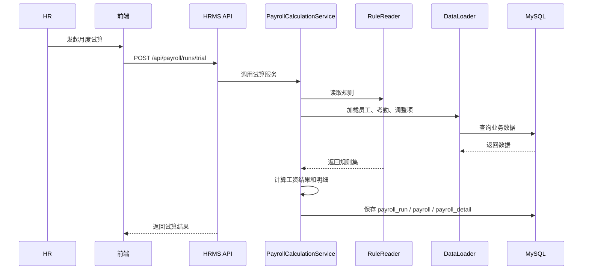
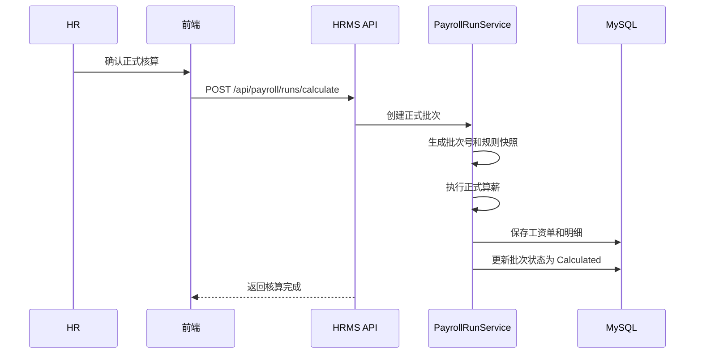
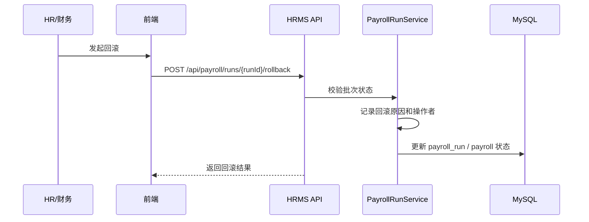
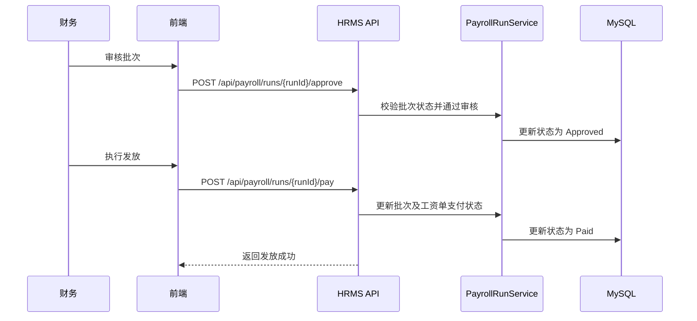

# 薪资系统技术设计说明书

## 1. 文档信息

### 1.1 文档目标

本文档用于对 HRMS 系统中的 `薪资系统第一版` 进行正式技术设计，覆盖以下内容：

- 建设背景与目标
- 现状评估与兼容策略
- 总体架构与模块边界
- 核心数据模型与数据库设计
- 接口设计与前端页面设计
- 月度算薪主流程与关键时序
- 非功能设计、实施路径与风险控制

本文档作为后续数据库建模、后端开发、前端开发、联调测试和上线实施的统一依据。

### 1.2 适用范围

- 当前 HRMS 系统中的薪资主数据管理
- 薪资规则配置、考勤与调整项输入、月度算薪、审核发放、工资条与报表
- 与现有 `employee`、`timesheet`、`salary_calculation` 模块的兼容和迁移
- 第一版不包含完整银行直连、自助门户、外部审批流和多渠道自动采集的最终形态，但会预留扩展点

### 1.3 设计原则

- 最小破坏
- 渐进上线
- 业务配置化
- 数据可追溯
- 计算可回滚
- 规则可扩展
- 口径可审计

## 2. 背景与建设目标

### 2.1 当前业务背景

当前 HRMS 已具备员工、组织、工时、基础薪资核算页面等能力，但薪资链路仍以“基础核算”为主，无法支撑正式月结场景。根据当前业务现状，企业需要一套能够覆盖制造业和项目制场景的薪资系统，支持以下典型员工类型：

- 管理层
- 自主员工-时薪
- 自主员工-计件
- 自主员工-底薪+计件
- 三方人员

同时，企业需要统一沉淀以下薪资业务能力：

- 薪资规则配置化
- 考勤和计件输入标准化
- 薪资调整项结构化
- 月度试算、正式核算、回滚、审核、发放闭环
- 工资条、汇总报表、成本分析

### 2.2 当前系统现状

结合当前仓库代码，已有以下基础：

1. 后端已有 `SalaryCalculationService`、`SalaryController`、`TimesheetService`、`TimesheetsController`
2. 前端已有 `SalaryCalculate.vue`、`SalaryList.vue`、`TimesheetList.vue`、`TimesheetImport.vue`
3. 数据库上下文 `HrmsDbContext` 已注册以下薪资域表：
   - `employee_type`
   - `employee_payroll_profile`
   - `salary_rule`
   - `overtime_rate_config`
   - `holiday_rule`
   - `attendance`
   - `salary_adjustment`
   - `income_tax_rule`
   - `payroll_run`
   - `payroll`
   - `payroll_detail`
4. 领域层已有 `PayrollEmployeeType`、`EmployeePayrollProfile`、`SalaryRule`、`PayrollRun`、`Payroll`、`PayrollDetail` 等实体雏形
5. 领域层已有 `IPayrollRepositories.cs` 中的仓储接口定义

### 2.3 当前主要问题

虽然已有一部分薪资代码基础，但整体仍处于“半成品”状态，主要问题包括：

1. 现有 `SalaryCalculationService` 以 `timesheet` 和 `salary_calculation` 为中心，尚未形成正式薪资批次模型
2. 算薪逻辑中存在硬编码参数，如加班倍率、试岗日薪、饭补规则等
3. 缺少正式月结批次 `payroll_run` 驱动的试算、核算、审核、发放流程
4. 缺少结构化调整项输入和规则快照留存机制
5. 缺少完整的工资条、审核发放、报表和回滚能力
6. 前端页面更偏操作草稿，尚未与正式薪资域模型完全对齐

### 2.4 建设目标

第一版建设目标如下：

1. 建立正式薪资域模型，替代硬编码的临时核算方式
2. 建立员工类型、薪资规则、加班费率、节假日、个税规则配置能力
3. 建立考勤、计件、调整项统一输入能力
4. 建立 `试算 -> 正式核算 -> 审核 -> 发放 -> 导出` 的标准月结流程
5. 建立工资条和汇总报表输出能力
6. 在不推翻现有系统的前提下，实现从 `salary_calculation` 向 `payroll` 的渐进迁移

### 2.5 第一版非目标

以下内容不作为第一版强制目标，但需保留扩展能力：

- 银行直连代发
- 员工自助工资条门户
- 与 OA 审批系统完整联动
- 自动同步钉钉、企微、考勤机原始记录
- 多法人、多账套、多币种能力

## 3. 总体架构设计

### 3.1 总体定位

薪资系统作为 HRMS 中的核心业务子域，与员工、组织、考勤、排班、第三方账单等模块存在天然关联。第一版采取“单体内聚、域内分层、后续可拆”的设计思路：

- 仍部署在现有 HRMS 后端中
- 按独立薪资域组织实体、仓储、服务、控制器和前端页面
- 通过标准数据结构与其他模块解耦
- 通过批次和快照机制保证可追溯与可审计

### 3.2 逻辑架构

```text
前端
  -> 薪资规则配置页面
  -> 考勤/调整项导入页面
  -> 月度算薪页面
  -> 薪资审核与工资条页面
  -> 报表页面

HRMS API
  -> PayrollConfigController
  -> PayrollProfileController
  -> PayrollDataInputController
  -> PayrollRunController
  -> PayrollReportController

Application
  -> EmployeeTypeService
  -> SalaryRuleService
  -> AttendanceService
  -> SalaryAdjustmentService
  -> PayrollCalculationService
  -> PayrollRunService
  -> PayrollReportService

Domain
  -> PayrollEmployeeType
  -> EmployeePayrollProfile
  -> SalaryRule
  -> OvertimeRateConfig
  -> HolidayRule
  -> Attendance
  -> SalaryAdjustment
  -> IncomeTaxRule
  -> PayrollRun
  -> Payroll
  -> PayrollDetail

Infrastructure
  -> HrmsDbContext
  -> Payroll Repositories
  -> Import Parser
  -> Rule Snapshot Builder

Data Source
  -> employee
  -> timesheet
  -> attendance
  -> salary_adjustment
  -> payroll*
```

### 3.3 模块划分

| 模块 | 说明 |
|------|------|
| 薪资主数据模块 | 员工类型、薪资档案、薪资规则、加班费率、节假日、个税规则维护 |
| 数据输入模块 | 考勤、计件、调整项录入与导入校验 |
| 算薪引擎模块 | 规则读取、员工分类、金额计算、明细生成、税费处理 |
| 月结流程模块 | 试算、正式核算、审核、发放、回滚 |
| 薪资查询模块 | 批次查询、个人薪资查询、工资条查看 |
| 报表导出模块 | 汇总报表、工资条导出、银行文件导出 |
| 审计留痕模块 | 规则快照、操作日志、状态流转、版本留痕 |

### 3.4 分层职责

#### 3.4.1 API 层

- 接收前端请求
- 参数校验与权限控制
- 返回统一响应结构
- 不承载复杂算薪业务逻辑

#### 3.4.2 Application 层

- 编排薪资业务流程
- 读取规则和输入数据
- 组织算薪步骤
- 管理批次状态流转

#### 3.4.3 Domain 层

- 承载薪资域实体和枚举
- 定义仓储接口和领域规则语义
- 保持与基础设施实现解耦

#### 3.4.4 Infrastructure 层

- EF Core 映射
- MySQL 数据访问
- Excel 导入解析
- 规则快照存储

## 4. 现有系统兼容与迁移策略

### 4.1 兼容原则

第一版不直接废弃现有薪资能力，而是采用“双轨兼容、逐步迁移”的方式：

1. 保留现有 `SalaryCalculationService` 与 `/api/v1/salary` 接口作为兼容层
2. 新增正式 `Payroll` 域服务和新接口，承接月结主流程
3. 新页面优先读取正式 `payroll_run`、`payroll`、`payroll_detail`
4. 历史 `salary_calculation` 数据保留，不强制迁移为正式工资单
5. 当正式薪资模块稳定后，再逐步将旧薪资核算入口降级为只读或试算兼容入口

### 4.2 当前代码可复用内容

| 现有内容 | 可复用方式 |
|------|------|
| `TimesheetService` / `TimesheetsController` | 作为考勤工时来源兼容层 |
| `SalaryCalculationService` | 逐步改造为旧版试算兼容层 |
| `PayrollModels.cs` | 作为正式薪资域第一版实体基础 |
| `IPayrollRepositories.cs` | 作为正式薪资域仓储接口基础 |
| `HrmsDbContext` 中薪资表映射 | 继续完善约束、索引和关联 |
| 现有前端 `salary` 页面 | 可拆分为正式月结页面与历史查询页面 |

### 4.3 迁移阶段建议

#### 4.3.1 阶段一

- 完成薪资域数据模型落地
- 完成规则配置和薪资档案管理
- 保持旧版薪资核算不受影响

#### 4.3.2 阶段二

- 引入正式 `PayrollCalculationService`
- 建立 `payroll_run` 驱动的试算和正式核算流程
- 新页面开始接入正式薪资域

#### 4.3.3 阶段三

- 将 `SalaryCalculationService` 标记为兼容层
- 旧页面仅保留历史数据浏览或轻量试算用途
- 正式运营口径全部切换到 `payroll` 域

## 5. 领域模型设计

### 5.1 核心实体

#### 5.1.1 员工类型 `PayrollEmployeeType`

用于定义不同员工的薪资计算模式和适用能力开关，包括：

- 类型编码、类型名称
- 薪资模式
- 是否计加班
- 是否有饭补、夜补、绩效、社保
- 排序和启停状态

#### 5.1.2 员工薪资档案 `EmployeePayrollProfile`

用于连接员工与薪资域配置，作为员工月结的主资料，包括：

- 员工
- 员工类型
- 薪资状态
- 参薪日期
- 银行卡信息
- 备注

#### 5.1.3 薪资规则 `SalaryRule`

用于定义员工类型在有效期内的薪资标准，包括：

- 固定工资
- 时薪
- 计件单价
- 底薪
- 饭补标准
- 夜补标准
- 绩效基数
- 默认加班倍数

#### 5.1.4 加班费率 `OvertimeRateConfig`

用于覆盖不同日期类型下的加班费率：

- 工作日
- 周末
- 法定节假日
- 生效日期范围

#### 5.1.5 节假日规则 `HolidayRule`

用于定义法定节假日、公司调休日及特殊加班口径。

#### 5.1.6 考勤记录 `Attendance`

作为正式薪资计算输入，承载结构化考勤数据，包括：

- 正常工时
- 加班工时
- 加班类型
- 计件数量
- 班次类型
- 夜班标识
- 来源与状态

#### 5.1.7 调整项 `SalaryAdjustment`

用于承载月度手工或系统生成的补贴、扣款、税费、社保、公积金等项目。

#### 5.1.8 个税规则 `IncomeTaxRule`

用于承载年度税率档、速算扣除数和起征点。

#### 5.1.9 薪资批次 `PayrollRun`

作为月结主表，承载一次试算或正式核算的上下文，包括：

- 批次号
- 年月
- 批次类型
- 状态
- 规则快照
- 适用员工范围
- 发起人、审批人、开始结束时间

#### 5.1.10 工资单 `Payroll`

作为员工月薪结果主表，承载汇总金额和状态，包括：

- 收入项汇总
- 扣减项汇总
- 实发工资
- 公司成本
- 员工快照
- 状态和关键时间

#### 5.1.11 工资明细 `PayrollDetail`

作为工资单明细项，用于精确记录每个计算组件的来源、数量、单价和金额。

### 5.2 核心关系

```text
Employee
  -> EmployeePayrollProfile
      -> PayrollEmployeeType
      -> SalaryRule
      -> OvertimeRateConfig

Employee
  -> Attendance
  -> SalaryAdjustment

PayrollRun
  -> Payroll
      -> PayrollDetail
      -> Employee
      -> PayrollEmployeeType
```

### 5.3 枚举建议

#### 5.3.1 员工类型编码

- `Management`
- `Hourly`
- `Piecework`
- `BasePlusPiecework`
- `ThirdParty`

#### 5.3.2 薪资模式

- `Fixed`
- `Hourly`
- `Piecework`
- `Mixed`

#### 5.3.3 批次状态

- `Draft`
- `Calculated`
- `Approved`
- `Paid`
- `RolledBack`

#### 5.3.4 调整项类型

- `Allowance`
- `Deduction`
- `SocialSecurityPersonal`
- `SocialSecurityCompany`
- `HousingFundPersonal`
- `HousingFundCompany`
- `IncomeTax`
- `MealAllowance`
- `NightShiftAllowance`
- `PerformanceBonus`
- `DisciplinaryDeduction`
- `Other`

#### 5.3.5 加班类型

- `Workday`
- `Weekend`
- `Holiday`

## 6. 功能模块设计

### 6.1 薪资主数据模块

#### 6.1.1 员工类型管理

功能范围：

- 维护类型名称、编码、薪资模式
- 配置是否允许加班、饭补、夜补、绩效、社保
- 控制启用停用

关键规则：

- 编码唯一
- 类型名称唯一
- 已被员工薪资档案引用的类型不允许直接删除

#### 6.1.2 员工薪资档案管理

功能范围：

- 绑定员工与员工类型
- 维护参薪状态
- 维护银行信息
- 维护参薪起止日期

关键规则：

- 每个员工仅允许存在一条当前有效档案
- 离职员工允许保留历史档案，不允许物理删除

#### 6.1.3 规则配置

功能范围：

- 薪资规则维护
- 加班费率维护
- 节假日维护
- 个税规则维护

关键规则：

- 同一员工类型、同一规则类型、同一时间段不能存在冲突有效记录
- 配置变更后，正式核算必须引用批次快照，不直接回读最新规则

### 6.2 数据输入模块

#### 6.2.1 考勤数据输入

支持方式：

- 页面单条维护
- 批量导入
- 从现有 `timesheet` 兼容生成

关键规则：

- 同一员工同一天只允许一条正式考勤记录
- 导入时需校验员工是否存在、是否参薪、日期是否合法
- 支持夜班、加班类型和计件数量

#### 6.2.2 计件数据输入

第一版不单独拆表，优先复用 `attendance.piecework_qty` 承载计件数量；若后续计件逻辑复杂，再扩展独立表。

#### 6.2.3 调整项输入

支持范围：

- 社保个人
- 社保公司
- 公积金个人
- 公积金公司
- 个税
- 餐补
- 夜补
- 绩效奖金
- 违纪扣款
- 其他补贴
- 其他扣款

关键规则：

- 调整项必须带年月
- 可记录来源和来源单据
- 自动生成项目与手工录入项目需可区分

#### 6.2.4 导入校验

导入流程建议：

1. 模板格式校验
2. 基础字段校验
3. 员工匹配校验
4. 重复数据校验
5. 错误结果回显
6. 成功数据入库

### 6.3 算薪引擎模块

#### 6.3.1 设计思路

算薪引擎建议拆分为以下子组件：

- 规则读取器 `PayrollRuleReader`
- 员工分类器 `PayrollEmployeeClassifier`
- 薪资计算器 `PayrollCalculator`
- 调整项汇总器 `PayrollAdjustmentAggregator`
- 个税处理器 `PayrollTaxCalculator`
- 明细生成器 `PayrollDetailBuilder`

#### 6.3.2 计算逻辑分类

第一版固定支持以下 5 类计算逻辑：

1. 管理层
2. 自主员工-时薪
3. 自主员工-计件
4. 自主员工-底薪+计件
5. 三方人员

#### 6.3.3 计算优先级

加班倍数判定优先级如下：

1. `holiday_rule.overtime_multiplier`
2. `overtime_rate_config.multiplier`
3. `salary_rule.default_overtime_multiplier`

#### 6.3.4 金额组成

工资单建议至少包含以下项目：

- 固定工资
- 正常工资
- 加班工资
- 计件工资
- 底薪
- 饭补
- 夜补
- 绩效奖金
- 其他补贴
- 社保个人
- 公积金个人
- 个税
- 其他扣款
- 实发工资
- 公司成本

### 6.4 月结流程模块

#### 6.4.1 试算

作用：

- 不影响正式发放口径
- 用于查看结果和发现异常
- 可支持整月试算和单人试算

关键规则：

- 可重复执行
- 保留试算批次
- 不直接覆盖已发放工资单

#### 6.4.2 正式核算

作用：

- 生成正式工资单
- 锁定批次口径
- 进入审核流转

关键规则：

- 同一员工、同一月份、同一正式批次不得重复生成
- 正式核算必须持久化规则快照

#### 6.4.3 回滚

作用：

- 对错误批次进行状态化回滚
- 保留历史记录和审计痕迹

关键规则：

- 不物理删除批次和工资单
- 回滚后批次状态更新为 `RolledBack`
- 回滚原因和操作人必须记录

#### 6.4.4 审核与发放

流程建议：

1. HR 发起正式核算
2. 财务审核批次
3. 财务执行发放
4. 系统更新工资单和批次状态

### 6.5 报表与导出模块

第一版至少支持以下输出：

- 个人工资条
- 批次薪资汇总
- 部门薪资汇总
- 公司社保、公积金成本汇总
- 银行代发导出预留接口

## 7. 核心业务规则设计

### 7.1 员工参薪规则

1. 员工必须存在有效的 `EmployeePayrollProfile`
2. 员工必须处于可参薪状态
3. 月中入职、月中离职员工需允许按规则参与当月核算
4. 员工类型变更应以核算日有效档案为准

### 7.2 规则生效规则

1. 规则按生效日期范围匹配
2. 正式核算以批次生成时的规则快照为准
3. 后续修改规则不影响历史已生成工资单

### 7.3 考勤取数规则

1. 第一版优先从 `attendance` 取数
2. 若业务未完成 `attendance` 维护，可从 `timesheet` 做兼容转换
3. 同一员工同日数据冲突时，以显式维护的 `attendance` 为准

### 7.4 个税规则

1. 个税按 `IncomeTaxRule` 进行年度匹配
2. 应税收入计算口径固定化，不在第一版开放复杂自由配置
3. 允许通过调整项覆盖个税结果，但需记录来源

### 7.5 审计规则

以下内容必须可追溯：

- 批次发起人
- 核算时间
- 审核人
- 发放人
- 回滚人
- 规则快照
- 导入来源
- 调整项来源

## 8. 关键流程设计

### 8.1 月度试算流程



### 8.2 正式核算流程



### 8.3 回滚流程



### 8.4 审核与发放流程



## 9. 接口设计

### 9.1 协议与风格

- 协议：`HTTP REST + JSON`
- 认证：复用现有 `JWT`
- 版本：建议沿用当前风格 `api/v1`
- 响应：复用现有 `{ code, message, data }` 结构

### 9.2 接口分组

#### 9.2.1 配置类接口

| 方法 | 路径 | 说明 |
|------|------|------|
| GET | `/api/v1/payroll/employee-types` | 查询员工类型 |
| POST | `/api/v1/payroll/employee-types` | 新增员工类型 |
| PUT | `/api/v1/payroll/employee-types/{id}` | 编辑员工类型 |
| GET | `/api/v1/payroll/salary-rules` | 查询薪资规则 |
| POST | `/api/v1/payroll/salary-rules` | 新增薪资规则 |
| PUT | `/api/v1/payroll/salary-rules/{id}` | 编辑薪资规则 |
| GET | `/api/v1/payroll/overtime-rate-configs` | 查询加班费率 |
| POST | `/api/v1/payroll/overtime-rate-configs` | 新增加班费率 |
| GET | `/api/v1/payroll/holiday-rules` | 查询节假日规则 |
| POST | `/api/v1/payroll/holiday-rules` | 新增节假日规则 |
| GET | `/api/v1/payroll/income-tax-rules` | 查询个税规则 |
| POST | `/api/v1/payroll/income-tax-rules` | 新增个税规则 |

#### 9.2.2 档案类接口

| 方法 | 路径 | 说明 |
|------|------|------|
| GET | `/api/v1/payroll/profiles` | 查询员工薪资档案 |
| GET | `/api/v1/payroll/profiles/{employeeId}` | 查询员工薪资档案详情 |
| POST | `/api/v1/payroll/profiles` | 新增薪资档案 |
| PUT | `/api/v1/payroll/profiles/{id}` | 编辑薪资档案 |
| POST | `/api/v1/payroll/profiles/import` | 导入薪资档案 |

#### 9.2.3 数据输入接口

| 方法 | 路径 | 说明 |
|------|------|------|
| GET | `/api/v1/payroll/attendance` | 查询考勤数据 |
| POST | `/api/v1/payroll/attendance` | 新增考勤数据 |
| PUT | `/api/v1/payroll/attendance/{id}` | 编辑考勤数据 |
| POST | `/api/v1/payroll/attendance/import` | 导入考勤数据 |
| GET | `/api/v1/payroll/adjustments` | 查询调整项 |
| POST | `/api/v1/payroll/adjustments` | 新增调整项 |
| PUT | `/api/v1/payroll/adjustments/{id}` | 编辑调整项 |
| POST | `/api/v1/payroll/adjustments/import` | 导入调整项 |

#### 9.2.4 月结接口

| 方法 | 路径 | 说明 |
|------|------|------|
| POST | `/api/v1/payroll/runs/trial` | 月度试算 |
| POST | `/api/v1/payroll/runs/calculate` | 正式核算 |
| POST | `/api/v1/payroll/runs/{runId}/rollback` | 回滚批次 |
| GET | `/api/v1/payroll/runs` | 查询薪资批次 |
| GET | `/api/v1/payroll/runs/{runId}` | 查询批次详情 |
| GET | `/api/v1/payroll/runs/{runId}/employees/{employeeId}` | 查询员工在批次中的工资结果 |
| POST | `/api/v1/payroll/runs/{runId}/approve` | 批次审核 |
| POST | `/api/v1/payroll/runs/{runId}/pay` | 批次发放 |

#### 9.2.5 报表导出接口

| 方法 | 路径 | 说明 |
|------|------|------|
| GET | `/api/v1/payroll/reports/summary` | 月度薪资汇总 |
| GET | `/api/v1/payroll/reports/department-summary` | 部门薪资汇总 |
| GET | `/api/v1/payroll/reports/payslips` | 工资条查询 |
| GET | `/api/v1/payroll/export/payslips` | 导出工资条 |
| GET | `/api/v1/payroll/export/bank-file` | 导出银行文件 |

### 9.3 兼容接口保留建议

现有接口暂保留：

- `GET /api/v1/salary`
- `GET /api/v1/salary/{id}`
- `GET /api/v1/salary/employee/{employeeId}`
- `POST /api/v1/salary/calculate`

后续建议：

1. 标注为旧版兼容接口
2. 不再承接正式薪资发放场景
3. 后期可下线为只读查询或试算兼容入口

## 10. 数据库设计

### 10.1 设计目标

数据库设计需满足以下要求：

- 可配置
- 可批次化
- 可追溯
- 可扩展
- 可审计

### 10.2 核心表设计概览

| 表名 | 说明 |
|------|------|
| `employee_type` | 员工类型 |
| `employee_payroll_profile` | 员工薪资档案 |
| `salary_rule` | 薪资规则 |
| `overtime_rate_config` | 加班费率配置 |
| `holiday_rule` | 节假日规则 |
| `attendance` | 薪资用考勤输入 |
| `salary_adjustment` | 薪资调整项 |
| `income_tax_rule` | 个税规则 |
| `payroll_run` | 薪资批次 |
| `payroll` | 工资单 |
| `payroll_detail` | 工资明细 |

### 10.3 核心表字段建议

#### 10.3.1 `employee_type`

| 字段 | 类型 | 说明 |
|------|------|------|
| id | char(36) | 主键 |
| type_code | varchar(64) | 类型编码，唯一 |
| type_name | varchar(100) | 类型名称，唯一 |
| salary_mode | varchar(32) | 薪资模式 |
| has_overtime | bit | 是否计加班 |
| has_meal_subsidy | bit | 是否有饭补 |
| has_night_subsidy | bit | 是否有夜补 |
| has_performance | bit | 是否有绩效 |
| has_social_security | bit | 是否有社保 |
| is_active | bit | 是否启用 |
| sort_order | int | 排序 |
| remark | varchar(500) | 备注 |
| created_at | datetime(6) | 创建时间 |
| updated_at | datetime(6) | 更新时间 |

#### 10.3.2 `employee_payroll_profile`

| 字段 | 类型 | 说明 |
|------|------|------|
| id | char(36) | 主键 |
| employee_id | char(36) | 员工 ID |
| employee_type_id | char(36) | 员工类型 ID |
| shift_type | varchar(32) | 班次类型 |
| bank_account | varchar(64) | 银行卡号 |
| payroll_status | varchar(32) | 参薪状态 |
| join_payroll_date | date | 参薪日期 |
| leave_payroll_date | date | 停薪日期 |
| remark | varchar(500) | 备注 |

#### 10.3.3 `salary_rule`

| 字段 | 类型 | 说明 |
|------|------|------|
| id | char(36) | 主键 |
| rule_code | varchar(64) | 规则编码 |
| rule_name | varchar(100) | 规则名称 |
| employee_type_id | char(36) | 员工类型 |
| effective_start | date | 生效开始 |
| effective_end | date | 生效结束 |
| fixed_salary | decimal(12,2) | 固定工资 |
| hourly_rate | decimal(10,2) | 时薪 |
| piecework_unit_price | decimal(10,2) | 计件单价 |
| base_salary_for_piecework | decimal(12,2) | 底薪 |
| meal_subsidy_per_day | decimal(10,2) | 饭补 |
| night_subsidy_per_day | decimal(10,2) | 夜补 |
| performance_base | decimal(12,2) | 绩效基数 |
| default_overtime_multiplier | decimal(6,2) | 默认加班倍数 |

#### 10.3.4 `attendance`

| 字段 | 类型 | 说明 |
|------|------|------|
| id | char(36) | 主键 |
| employee_id | char(36) | 员工 |
| work_date | date | 工作日期 |
| normal_hours | decimal(6,2) | 正常工时 |
| overtime_hours | decimal(6,2) | 加班工时 |
| overtime_type | varchar(32) | 加班类型 |
| piecework_qty | decimal(12,2) | 计件数量 |
| shift_type | varchar(32) | 班次类型 |
| is_night_shift | bit | 是否夜班 |
| attendance_source | varchar(32) | 来源 |
| source_record_id | varchar(128) | 来源记录 ID |
| status | varchar(32) | 状态 |

#### 10.3.5 `salary_adjustment`

| 字段 | 类型 | 说明 |
|------|------|------|
| id | char(36) | 主键 |
| employee_id | char(36) | 员工 |
| year_month | varchar(7) | 年月 |
| adjustment_type | varchar(64) | 调整类型 |
| amount | decimal(12,2) | 金额 |
| source_type | varchar(32) | 来源类型 |
| source_id | varchar(64) | 来源单据 |
| is_auto_generated | bit | 是否自动生成 |
| remark | varchar(500) | 备注 |
| created_by | varchar(64) | 创建人 |
| updated_by | varchar(64) | 更新人 |

#### 10.3.6 `payroll_run`

| 字段 | 类型 | 说明 |
|------|------|------|
| id | char(36) | 主键 |
| run_no | varchar(64) | 批次号 |
| year_month | varchar(7) | 年月 |
| run_type | varchar(32) | 批次类型 |
| status | varchar(32) | 状态 |
| employee_scope_json | json | 员工范围快照 |
| rule_snapshot_json | json | 规则快照 |
| triggered_by | varchar(64) | 发起人 |
| approved_by | varchar(64) | 审核人 |
| approved_at | datetime(6) | 审核时间 |
| started_at | datetime(6) | 开始时间 |
| finished_at | datetime(6) | 结束时间 |
| remark | varchar(1000) | 备注 |

#### 10.3.7 `payroll`

| 字段 | 类型 | 说明 |
|------|------|------|
| id | char(36) | 主键 |
| payroll_run_id | char(36) | 所属批次 |
| employee_id | char(36) | 员工 |
| employee_type_id | char(36) | 员工类型 |
| year_month | varchar(7) | 年月 |
| employee_no_snapshot | varchar(64) | 工号快照 |
| employee_name_snapshot | varchar(100) | 姓名快照 |
| org_unit_id_snapshot | char(36) | 组织快照 |
| salary_mode_snapshot | varchar(32) | 薪资模式快照 |
| normal_wage | decimal(12,2) | 正常工资 |
| overtime_wage | decimal(12,2) | 加班工资 |
| piecework_wage | decimal(12,2) | 计件工资 |
| fixed_salary | decimal(12,2) | 固定工资 |
| base_salary | decimal(12,2) | 底薪 |
| meal_subsidy | decimal(12,2) | 饭补 |
| night_subsidy | decimal(12,2) | 夜补 |
| performance_bonus | decimal(12,2) | 绩效 |
| other_allowance | decimal(12,2) | 其他补贴 |
| social_security_employee | decimal(12,2) | 社保个人 |
| social_security_company | decimal(12,2) | 社保公司 |
| provident_fund_employee | decimal(12,2) | 公积金个人 |
| provident_fund_company | decimal(12,2) | 公积金公司 |
| income_tax | decimal(12,2) | 个税 |
| other_deduction | decimal(12,2) | 其他扣款 |
| total_gross | decimal(12,2) | 应发 |
| net_salary | decimal(12,2) | 实发 |
| total_company_cost | decimal(12,2) | 公司成本 |
| status | varchar(32) | 状态 |

#### 10.3.8 `payroll_detail`

| 字段 | 类型 | 说明 |
|------|------|------|
| id | char(36) | 主键 |
| payroll_id | char(36) | 工资单 ID |
| component_code | varchar(64) | 组件编码 |
| component_name | varchar(100) | 组件名称 |
| component_category | varchar(32) | 组件类别 |
| amount | decimal(12,2) | 金额 |
| quantity | decimal(12,2) | 数量 |
| unit_price | decimal(12,2) | 单价 |
| sort_order | int | 排序 |
| source_type | varchar(32) | 来源类型 |
| source_id | varchar(64) | 来源 ID |
| remark | varchar(500) | 备注 |

### 10.4 索引与约束建议

1. `employee_type.type_code` 唯一
2. `employee_payroll_profile.employee_id` 唯一
3. `attendance(employee_id, work_date)` 唯一
4. `income_tax_rule(rule_year, level_no)` 唯一
5. `holiday_rule(holiday_date, holiday_type)` 唯一
6. `payroll_run.run_no` 唯一
7. `payroll(payroll_run_id, employee_id)` 唯一

### 10.5 快照策略

为保证历史结果不受后续配置变更影响，以下内容建议按批次做快照：

- 员工范围
- 员工类型快照
- 薪资规则快照
- 加班费率快照
- 节假日规则快照
- 个税规则快照

## 11. 前端设计建议

### 11.1 页面规划

#### 11.1.1 配置类页面

- 员工类型管理
- 薪资规则管理
- 加班费率配置
- 节假日规则管理
- 个税规则管理
- 员工薪资档案管理

#### 11.1.2 数据输入类页面

- 考勤数据管理
- 考勤导入
- 调整项管理
- 调整项导入
- 导入结果页

#### 11.1.3 月结流程类页面

- 月度算薪
- 薪资批次详情
- 单人试算弹窗或抽屉
- 薪资审核
- 发放记录

#### 11.1.4 查询报表类页面

- 工资条查询
- 批次汇总报表
- 部门汇总报表
- 成本分析页

### 11.2 前端交互建议

1. 月结页面必须支持试算、正式核算、回滚、审核、发放
2. 试算结果应展示汇总指标、异常预警、按类型分组结果
3. 导入页面应展示错误明细并支持下载失败记录
4. 工资条页面应支持单人查看和批量导出

### 11.3 与现有页面关系

当前前端已有：

- `hrms-web/src/views/salary/SalaryCalculate.vue`
- `hrms-web/src/views/salary/SalaryList.vue`
- `hrms-web/src/views/timesheet/TimesheetList.vue`
- `hrms-web/src/views/timesheet/TimesheetImport.vue`

建议调整方式：

1. `SalaryCalculate.vue` 逐步重构为正式月度算薪页面
2. `SalaryList.vue` 拆分为薪资批次列表和工资条查询页
3. `TimesheetImport.vue` 保留为工时导入兼容入口，并逐步补充正式考勤导入页

## 12. 权限设计

### 12.1 权限点建议

- `payroll.employeeType.view`
- `payroll.employeeType.edit`
- `payroll.salaryRule.view`
- `payroll.salaryRule.edit`
- `payroll.profile.view`
- `payroll.profile.edit`
- `payroll.attendance.view`
- `payroll.attendance.import`
- `payroll.adjustment.view`
- `payroll.adjustment.import`
- `payroll.run.trial`
- `payroll.run.calculate`
- `payroll.run.rollback`
- `payroll.run.approve`
- `payroll.run.pay`
- `payroll.report.view`
- `payroll.export.payslip`
- `payroll.export.bank`

### 12.2 角色建议

#### 12.2.1 HR

- 管理员工薪资档案
- 导入考勤和调整项
- 发起试算和正式核算
- 查看异常和工资明细

#### 12.2.2 财务

- 审核批次
- 发放工资
- 导出工资条和银行文件
- 查看成本和汇总报表

#### 12.2.3 系统管理员

- 初始化规则和权限
- 处理异常配置和系统维护

## 13. 非功能设计

### 13.1 性能要求

建议以第一版目标规模作为验收基线：

1. 单月 500 名员工的正式核算控制在 3 分钟内
2. 单人试算响应时间控制在 3 秒内
3. 导入 5000 条数据时可在合理时间内返回校验结果
4. 常规工资条或汇总报表导出控制在 1 分钟内

### 13.2 一致性设计

1. 批次状态流转必须具备明确前后置条件
2. 正式核算需使用事务保证批次、工资单、明细一致写入
3. 审核、发放、回滚需防重提交

### 13.3 安全设计

1. 薪资页面和接口必须启用权限控制
2. 工资数据属于敏感信息，导出需受控
3. 银行卡信息建议做脱敏展示
4. 所有关键操作写审计日志

### 13.4 可观测性设计

建议记录以下日志：

- 批次创建日志
- 导入日志
- 算薪耗时日志
- 异常员工日志
- 状态流转日志
- 导出日志

## 14. 实施方案

### 14.1 推荐开发顺序

#### 14.1.1 第一阶段：底座建设

- 建表 SQL
- 实体完善
- `DbContext` 映射完善
- 仓储实现
- 种子数据初始化

#### 14.1.2 第二阶段：规则配置

- 员工类型管理
- 薪资规则管理
- 加班费率配置
- 节假日规则配置
- 个税规则配置

#### 14.1.3 第三阶段：数据输入与算薪

- 员工薪资档案
- 考勤数据管理
- 调整项管理
- 导入校验
- 单人试算
- 全月正式核算

#### 14.1.4 第四阶段：流程闭环

- 回滚
- 审核
- 发放
- 工资条
- 报表导出

### 14.2 建议里程碑

#### 14.2.1 M1：薪资域建模完成

完成标准：

- 数据表可用
- 实体和仓储可用
- 基础种子数据可初始化

#### 14.2.2 M2：规则配置完成

完成标准：

- 配置 API 可用
- 配置页面可用
- 权限点可控制

#### 14.2.3 M3：月结主链路打通

完成标准：

- 数据导入可用
- 试算和正式核算可用
- 工资单和明细可生成

#### 14.2.4 M4：运营闭环完成

完成标准：

- 审核和发放可用
- 工资条和报表可导出
- 回滚和留痕可用

### 14.3 推荐目录规划

#### 14.3.1 后端

- `src/HRMS.Domain/Entities/Payroll`
- `src/HRMS.Domain/Enums/Payroll`
- `src/HRMS.Domain/Interfaces/Payroll`
- `src/HRMS.Application/Services/Payroll`
- `src/HRMS.Application/DTOs/Payroll`
- `src/HRMS.Infrastructure/Repositories/Payroll`
- `src/HRMS.API/Controllers/Payroll`

#### 14.3.2 前端

- `hrms-web/src/views/payroll`
- `hrms-web/src/components/payroll`
- `hrms-web/src/api/payroll.js`
- `hrms-web/src/utils/payroll`

## 15. 测试建议

### 15.1 核心测试场景

1. 管理层固定工资计算正确
2. 时薪员工正常工时和加班工时计算正确
3. 计件员工按数量和单价计算正确
4. 底薪加计件模式汇总正确
5. 三方人员逻辑独立正确
6. 加班费率优先级正确
7. 调整项增减汇总正确
8. 个税、社保、公积金口径正确
9. 回滚后可重新核算
10. 发放后状态流转正确

### 15.2 边界场景

1. 月中入职
2. 月中离职
3. 员工类型月中变更
4. 无考勤但有固定工资
5. 存在夜班和跨天情况
6. 存在重复导入数据
7. 存在缺失薪资档案数据

## 16. 风险与控制措施

### 16.1 主要风险

1. 现有薪资规则口径不完整，存在大量口头规则
2. 考勤和计件历史数据格式不统一
3. 业务部门与财务部门口径可能不一致
4. 试算结果与手工工资表差异可能阻碍上线
5. 正式批次回滚如果设计不当会影响审计

### 16.2 控制措施

1. 上线前整理《薪资规则确认表》，由 HR 和财务共同确认
2. 第一版严格限制员工类型和规则模型数量，避免过度设计
3. 所有正式核算使用批次快照
4. 保留调整项作为兜底手段
5. 上线前至少完成一轮平行跑数，与手工工资表抽样对账

## 17. 结论

本方案以“最小破坏、分阶段上线、兼容现有系统”为核心，适合当前 HRMS 项目第一版薪资系统建设。其关键价值在于：

1. 保留现有 `salary_calculation` 能力，降低存量改造风险
2. 以正式 `payroll_run`、`payroll`、`payroll_detail` 为核心建立标准薪资域
3. 通过规则配置、批次快照和状态流转实现可审计、可回滚、可扩展
4. 通过分阶段建设方式，优先打通规则配置和月结主链路，再逐步补齐审核、发放和报表

建议按本文档直接进入以下执行顺序：

1. 先输出 `HRMS_Payroll_V1_Schema.sql`
2. 再完善后端实体、仓储和 `DbContext`
3. 然后实现规则配置与月度算薪服务
4. 最后完成前端月结、审核和导出页面
